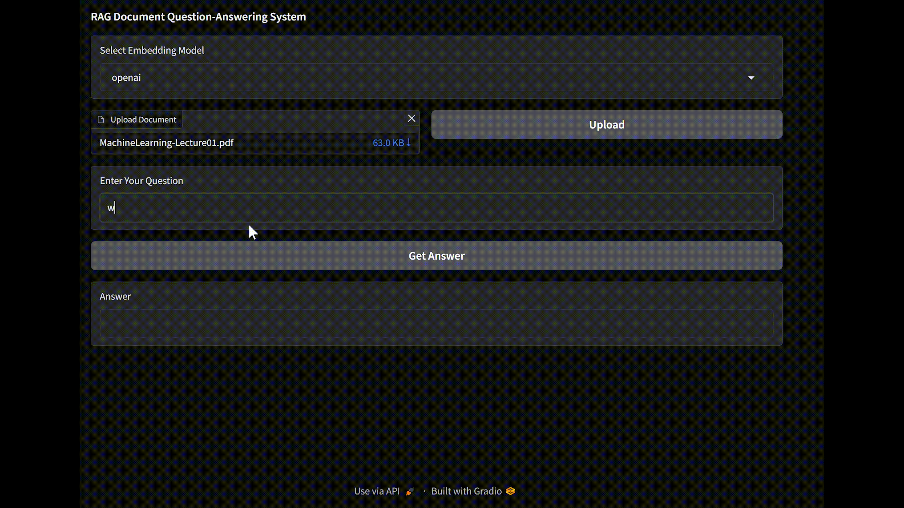

# RAG Document Question-Answering System

This repository implements a Retrieval-Augmented Generation (RAG) based document question-answering system. The system uses embeddings to preprocess and store documents, enabling users to query the content efficiently through a Flask API and Gradio interface.

---

## Features

- **Document Upload and Processing**: Upload `.txt` and `.pdf` files for text extraction and embedding.
- **Multiple Embedding Models**: Supports HuggingFace, Ollama, and OpenAI embeddings.
- **Question Answering**: Provides accurate answers to user queries by leveraging document embeddings and a conversational LLM.
- **Interactive Gradio Interface**: Easily interact with the system through a user-friendly web app.

---

## Installation

### Prerequisites
- Python 3.8 or above
- `pip` for dependency installation
- [Ollama](https://ollama.com) installed for using the `phi3` and `nomic-embed-text` models.

### Steps
1. Clone the repository:
```bash
   git clone https://github.com/MhmdRhayem/RAG-Document-Question-Answering-System
```

2. Install dependencies:
```bash
pip install -r requirements.txt
```

3. (Optional) If you plan to use Ollama models (phi3 or nomic-embed-text), download them:
```bash
ollama pull phi3
ollama pull nomic-embed-text
```

4. Set up API keys if using OpenAI embeddings:
- create a `.env` file and write inside it
```bash
OPENAI_API_KEY="YOUR_OPEN_API_KEY"
```

5. Run the Flask backend:
```bash
python app.py
```

6. Launch the Gradio app:
```bash
python gradio_app.py
```

## Technologies Used
- **Backend:** Flask
- **Frontend:** Gradio
- **Embedding Models:**  all-MiniLM-L6-v2, nomic-embed-text, OpenAI
- **Vector Store:** Chroma
- **LLM:** OpenAI GPT or phi3 

## Preview
Below is a preview of the Gradio interface for the RAG Document Question-Answering System:
  
